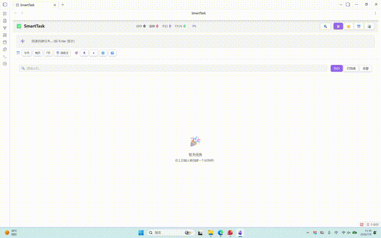

# SmartTask

> A high-performance, user-friendly smart task management plugin for Obsidian

[](https://opensource.org/licenses/MIT)
[](https://obsidian.md)

## Demo



## Features

### Multiple Views

- **List View**: Classic task list with grouping, sorting, and collapsible sections
- **Kanban View**: Column-based display by priority or status; drag tasks between "Todo" and "Done" columns to toggle completion (HTML5 drag-and-drop, keyboard accessible)
- **Calendar View**: Date-based task distribution for intuitive schedule visualization
- **Timeline View**: Four styles available:
  - Zigzag Timeline: Alternating left-right card layout
  - Gantt Chart: Task bars displayed by day/week/month, spanning from creation to due date

### Quick Task Creation

- Compact input toolbar with due date and priority displayed as inline chips
- Auto-record task creation time (🛫 start time) for easy tracking
- Three save modes:
  - **Inbox**: Save to a specified file
  - **Current File**: Save to the currently edited file
  - **Daily Note**: Save to today's daily note
- Auto-add configured tags

### Subtask Support

- Unlimited nesting levels for subtasks
- Subtask progress tracking
- Subtask support across all views
- Shortcut `Ctrl+Shift+Enter` to add subtasks

### Smart Query & Filter

- Filter by status (All / Uncompleted / Completed)
- Filter by priority (Highest / High / Medium / Low / Lowest)
- Filter by tags
- Filter by date range
- Text search
- Multi-field sorting (due date, priority, description, creation time, completion time)
- Multi-dimensional grouping (file, priority, due date, tag)

### Obsidian Native Features

- `[[Wiki Links]]` in task descriptions render as clickable links
- `#Tags` in task descriptions render as clickable elements for quick filtering
- Task data stored in Markdown format, preserving original file structure

### Performance Optimization

- Incremental indexing based on file mtime + size
- Batch processing (10ms yield) to prevent UI blocking
- Debounced search input (150ms) to reduce re-render churn
- Cached `getAllTags()` results, invalidated on task changes
- Filter-tab switching uses local class toggles (preserves scroll position)

## Installation

### Method 1: Manual Installation (Recommended)

1. Download the latest [Release](https://github.com/fat-pumpkin/SmarTask/releases)
2. Copy `main.js`, `styles.css`, and `manifest.json` to your Vault:
   ```
   <YourVault>/.obsidian/plugins/smarttask/
   ```
3. Open `Settings → Community plugins` in Obsidian and disable safe mode
4. Find **SmartTask** and enable it

### Method 2: Build from Source

```bash
git clone https://github.com/fat-pumpkin/SmarTask.git
cd SmarTask
npm install
npm run build
```

Copy the built `main.js` and `styles.css` to the plugin directory.

## Usage

### Basic Operations

| Action | Method |
|--------|--------|
| Open SmartTask View | Click sidebar icon or run command `Open SmartTask View` |
| Quick Create Task | Command Palette → `Quick Create Task`, shortcut `Ctrl+Shift+T` |
| Toggle Task Status | Command Palette → `Toggle Task Status`, shortcut `Ctrl+Enter` |
| Add Subtask | Command Palette → `Add Subtask`, shortcut `Ctrl+Shift+Enter` |

### Task Syntax

Tasks use standard Markdown Checkbox format with support for the following metadata:

```markdown
- [ ] Task description [[Linked Note]] #tag 📅 2026-07-15 🛫 2026-07-02 🔺
```

| Marker | Meaning |
|--------|---------|
| `📅` | Due date |
| `🛫` | Start time (auto-added on creation) |
| `🔝` | Highest priority |
| `🔺` | High priority |
| `🔼` | Medium priority |
| `🔽` | Low priority |
| `⏬` | Lowest priority |
| `[[Note Name]]` | Obsidian wiki link |
| `#tag` | Tag |

### View Switching

Switch between four views using the toolbar at the top of the SmartTask view:
- 📋 List View
- 📌 Kanban View
- 📅 Calendar View
- 📊 Timeline View

Timeline view supports four styles: Classic, Zigzag, Card, and Gantt.

## Settings

| Setting | Description | Default |
|---------|-------------|---------|
| Default Save Location | Inbox / Current File / Daily Note | Inbox |
| Inbox File Path | File path for inbox mode | `SmartTask-Inbox.md` |
| Auto-add Tags | Tags automatically added to new tasks | None |
| Default View | View shown on plugin open | List View |
| Default Priority | Priority for new tasks | Medium |
| Show Completed Tasks | Display completed tasks in list | Off |
| Timeline Grouping | Group by day/week/month | Day |
| Timeline Style | Classic/Gantt/Zigzag/Card | Classic |

## Tech Stack

- **TypeScript** + **esbuild** for building
- **Obsidian Plugin API** for integration
- Native DOM manipulation for UI rendering

## Project Structure

```
├── src/
│   ├── main.ts              # Plugin entry point
│   ├── view.ts              # View registration
│   ├── smartTaskView.ts     # View rendering logic
│   ├── settings.ts          # Settings panel
│   ├── types.ts             # Type definitions
│   ├── taskParser.ts        # Task parser
│   ├── taskIndex.ts         # Task indexing engine
│   ├── queryEngine.ts       # Query engine
│   ├── quickCreateHelpers.ts # Shared QuickCreate option builders
│   └── i18n/                # Internationalization (en / zh / index)
├── main.js                  # Build output
├── styles.css               # Stylesheet
├── manifest.json            # Plugin manifest
├── versions.json            # Plugin version → minAppVersion map
└── esbuild.config.mjs       # Build configuration
```

## Obsidian Community Plugin Compliance

This plugin follows the [Obsidian community plugin review guidelines](https://docs.obsidian.md/Plugins/Releasing/Submit+your+plugin):

- **License**: MIT (see [LICENSE](LICENSE))
- **No network requests**: The plugin operates fully offline; it does not make any external HTTP calls or phone home. All task data stays in your vault.
- **No telemetry / analytics**: No usage tracking, no error reporting, no remote logging.
- **No global `app` instance**: All API access goes through the injected `App` / `Plugin` context.
- **Minimal console output**: `console.*` calls are limited to error paths only (no verbose logging in normal operation).
- **Manifest `id`**: lowercase, no spaces (`smarttask`), matches the community plugin listing.
- **Code organization**: source files live under `src/` with focused responsibilities (parser, index, query engine, view, settings, i18n).
- **Semantic versioning**: `versions.json` maps each plugin version to the minimum required Obsidian app version.

## Changelog

See [CHANGELOG.md](CHANGELOG.md) for the full history.

### 2.0.1

- **Added**: Custom checkbox with completion animation, skeleton loading states, CSS tooltips, empty-state illustration, kanban HTML5 drag-and-drop (todo ⇄ done), keyboard navigation (↑/↓/Space/E/Esc), debounced search, `getAllTags()` caching, a11y attributes (`role`/`aria-label`/`tabindex`).
- **Improved**: Row2 button labels, calendar task bars, i18n migration of settings + remaining hardcoded strings, `setIcon()` for lucide icons, `--priority-*` CSS variables, local filter-tab re-render, shared QuickCreate helper.
- **Fixed**: 13+ i18n regressions, subtask indent calculation, DOM reflow on task add, uncleaned timers, 6 hardcoded hex colors, responsive breakpoints at 768px/480px.
- **Docs**: README calibrated (removed "virtual scrolling" claim), added Obsidian compliance section.

## Version Release

This project uses GitHub Actions for automatic releases. Create a tag to trigger the release workflow:

```bash
git tag 1.0.0
git push origin 1.0.0
```

GitHub Actions will automatically build and create a Release with `main.js`, `manifest.json`, and `styles.css`, enabling Obsidian to perform online updates.

## License

[MIT License](LICENSE)